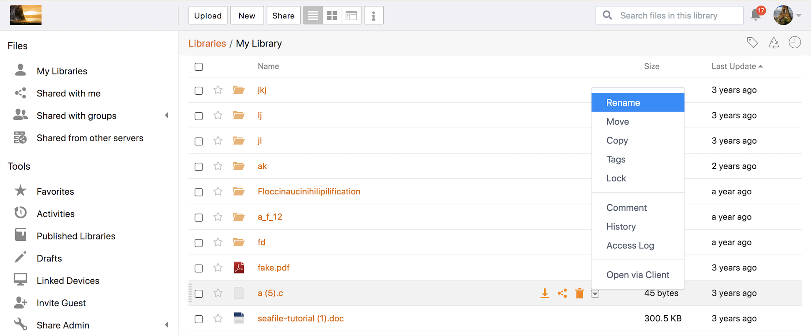

# Seafile
- Too simple, just raw files nothing more.
- Has mobile apps.

<br>

- [Homepage](https://www.seafile.com/en/home/)
- [Github repo](https://github.com/haiwen/seafile)
- [DockerHub repo](https://hub.docker.com/r/seafileltd/seafile-mc)
- [Docs](https://download.seafile.com/d/320e8adf90fa43ad8fee/files/?p=%2Findex.md)




## docker-compose.yml
```yml
version: '2.0'
services:
  db:
    image: mariadb:10.1
    container_name: seafile-mysql
    environment:
      - MYSQL_ROOT_PASSWORD=db_dev  # Requested, set the root's password of MySQL service.
      - MYSQL_LOG_CONSOLE=true
    volumes:
      - ./db:/var/lib/mysql  # Requested, specifies the path to MySQL data persistent store.
    networks:
      - seafile-net

  memcached:
    image: memcached:1.5.6
    container_name: seafile-memcached
    entrypoint: memcached -m 256
    networks:
      - seafile-net

  seafile:
    image: seafileltd/seafile-mc:latest
    container_name: seafile
    ports:
      - "8080:80"
#     - "443:443"  # If https is enabled, cancel the comment.
    volumes:
      - ./data:/shared   # Requested, specifies the path to Seafile data persistent store.
    environment:
      - DB_HOST=db
      - DB_ROOT_PASSWD=db_dev    # Requested, the value shuold be root's password of MySQL service.
      - TIME_ZONE=Europe/Dublin  # Optional, default is UTC. Should be uncomment and set to your local time zone.
      - SEAFILE_ADMIN_EMAIL=me@example.com # Specifies Seafile admin user, default is 'me@example.com'.
      - SEAFILE_ADMIN_PASSWORD=asecret     # Specifies Seafile admin password, default is 'asecret'.
      - SEAFILE_SERVER_LETSENCRYPT=false   # Whether to use https or not.
      - SEAFILE_SERVER_HOSTNAME=docs.seafile.com # Specifies your host name if https is enabled.
    depends_on:
      - db
      - memcached
    networks:
      - seafile-net

networks:
  seafile-net:
```
